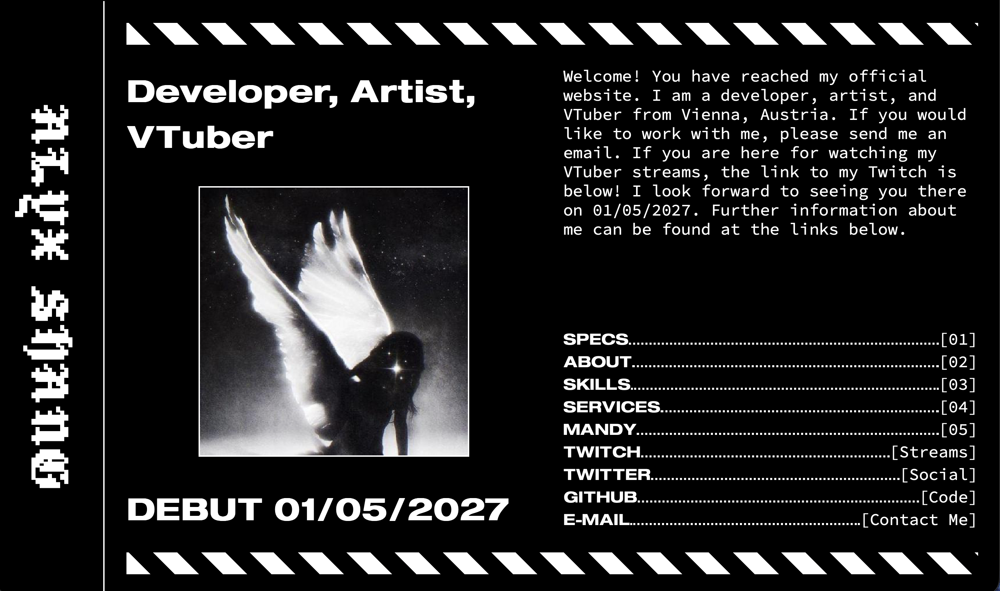

# WEBSITE


***A fast and light static-site generator.***

## ABOUT

This repository contains the source code my official website. The source code is in the form of a Mandy project. This file structure is the file structure that the Mandy static-site generator expects. More information about Mandy can be found [here](https://github.com/alyxshang/mandy).

## VISIT

The live site can be viewed [here](https://alyxshang.boo).

## SCREENSHOT

The image below is a screenshot of the site:

<p align="center">
 
</p>

## USAGE

To use or test this site, you must have [Mandy](https://github.com/alyxshang/mandy) installed.

### Build the site.

- 1.) Download the source code using the command below:

```bash
git clone --depth=1 https://github.com/alyxshang/website.git
```

- 2.) Change directory into the source code's root directory:

```bash
cd website
```

- 3.) Build the site using Mandy:

```bash
mandy -b .
```

- 4.) There should now be a directory by the name of `dist`, ready to be deployed to a server.

### Run the unit tests

- 1.) Download the source code using the command below:

```bash
git clone --depth=1 https://github.com/alyxshang/website.git
```

- 2.) Change directory into the source code's root directory:

```bash
cd website
```

- 3.) Run Mandy's site-building tests:

```bash
mandy -t .
```

- 4.) You should have receieved a message about the success or failure and number of tests run.

## NOTE

- *Website* by *Alyx Shang*.
- Licensed under the [FSL v1](https://alyxshang.boo/content/fair-software-license).
